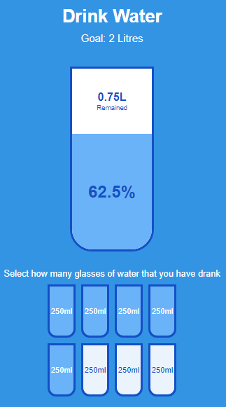

# Drink Water

A simple web application to help you track your daily water intake. The goal is to drink 2 litres of water every day, and this app provides a visual way to keep track of how much water you've consumed.

## Table of Contents

- [Features](#features)
- [Screenshot](#screenshot)
- [Installation](#installation)
- [Usage](#usage)
- [Contributing](#contributing)
- [Credits](#credits)

## Features

- Visual representation of water intake.
- Responsive design for different screen sizes.
- Easy-to-use interface.

## Screenshot



### Installation

1. Clone the repository:

   ```bash
   git clone https://github.com/amit712singhal/drink-water.git
   ```

2. Navigate to the project directory:

   ```bash
   cd drink-water
   ```

## Usage

- Open the index.html file in your web browser or simply checkout the deployed website under "About" section.
- Click on the small cups (250ml each) to mark them as consumed.
- The large cup will fill up to show your progress towards the 2-litre goal.
- The remaining amount of water needed to reach the goal is displayed.

## Contributing

Contributions are welcome! If you'd like to contribute to the project, please follow these steps:

1. Fork the repository.
2. Create your feature branch (`git checkout -b feature/YourFeature`).
3. Commit your changes (`git commit -am 'Add some feature'`).
4. Push to the branch (`git push origin feature/YourFeature`).
5. Create a new Pull Request.

## Credits

This project was created as part of a [50 Projects in 50 Days Course](https://www.udemy.com/course/50-projects-50-days/) on Udemy. Credits go to Brad Traversy & Florin Pop for providing guidance and resources.
